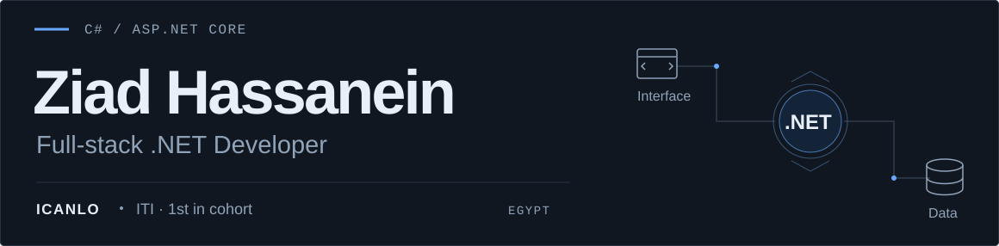
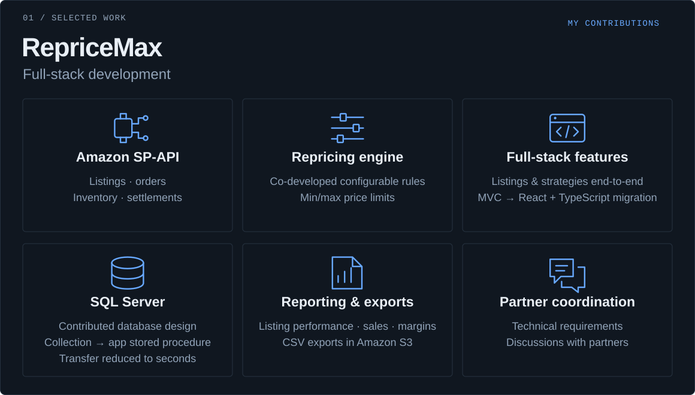
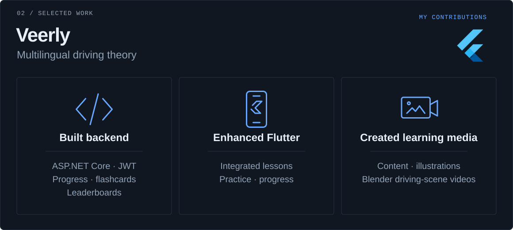
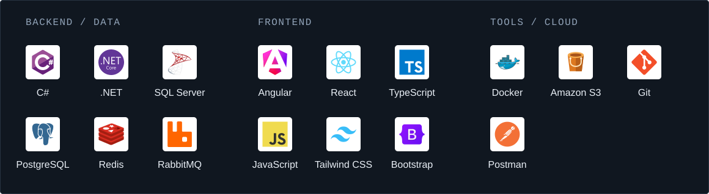

<picture>
  <source media="(max-width: 600px)" srcset="./assets/profile-hero-mobile.svg" />
  
</picture>

  
  

<picture>
  <source media="(max-width: 600px)" srcset="./assets/project-repricemax-mobile.svg" />
  
</picture>

<picture>
  <source media="(max-width: 600px)" srcset="./assets/project-veerly-mobile.svg" />
  
</picture>

<picture>
  <source media="(max-width: 600px)" srcset="./assets/stack-map-mobile.svg" />
  
</picture>

More .NET &amp; architecture

ASP.NET Core · Web API · EF Core · LINQ · SignalR · Clean Architecture · CQRS / MediatR · MassTransit · gRPC

**Explore the code →** [Pagination](https://github.com/ZiadHassanein/PaginationPattern) · [Result pattern](https://github.com/ZiadHassanein/ResultPattern) · [Exception handling](https://github.com/ZiadHassanein/GlobalExceptions)
