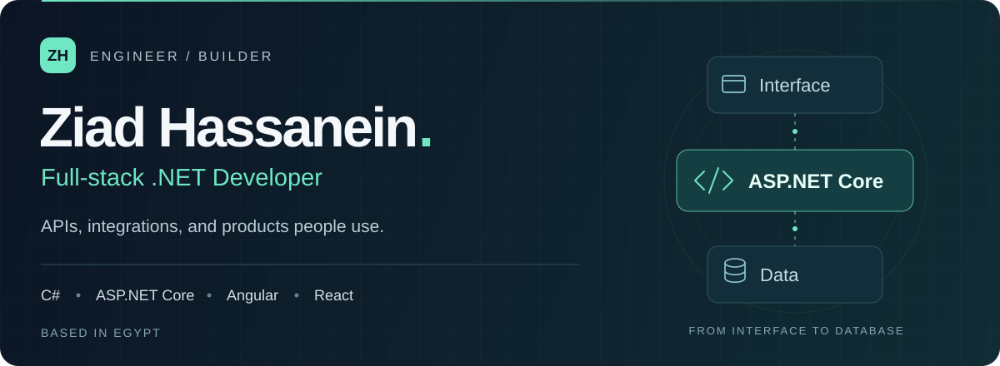
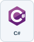
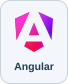
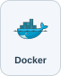

  <picture>
    <source media="(max-width: 600px)" srcset="./assets/header-mobile.svg" />
    
  </picture>

  
  &nbsp;
  

**Software Developer @ Icanlo** · ITI Full-Stack .NET graduate, **1st in my cohort**.

## Selected work

<table>
  <tr>
    <td width="60" align="center"></td>
    <td><strong>RepriceMax</strong> Contributing to Amazon integrations, repricing workflows, and React UI.</td>
  </tr>
  <tr>
    <td width="60" align="center"></td>
    <td><strong>Veerly</strong> Built the backend for a multilingual driving-theory app.</td>
  </tr>
  <tr>
    <td width="60" align="center"></td>
    <td><strong><a href="https://github.com/Ziad501/Elite">Elite ↗</a></strong> ASP.NET Core MVC storefront with accounts and a shopping cart.</td>
  </tr>
</table>

**Code patterns:** [Pagination](https://github.com/Ziad501/PaginationPattern) · [Results](https://github.com/Ziad501/ResultPattern) · [Exception handling](https://github.com/Ziad501/GlobalExceptions)

## Stack

  
  
  
  
  
  

